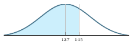

LaTex Shaded Gauss
==================

A LaTeX style file that plots a shaded gaussian curve.

This package renders shaded gaussian curves.

Usage:
* `\midshadedgauss{mean}{std.dev}{xmin}{xmax}{start of shaded area}{end of shaded area}`
* `\leftshadedgauss{mean}{std.dev}{xmin}{xmax}{end of shaded area}`
* `\rightshadedgauss{mean}{std.dev}{xmin}{xmax}{start of shaded area}`

A good rule of thumb for xmin and xmax is mean +/- 2.5*std.dev.
